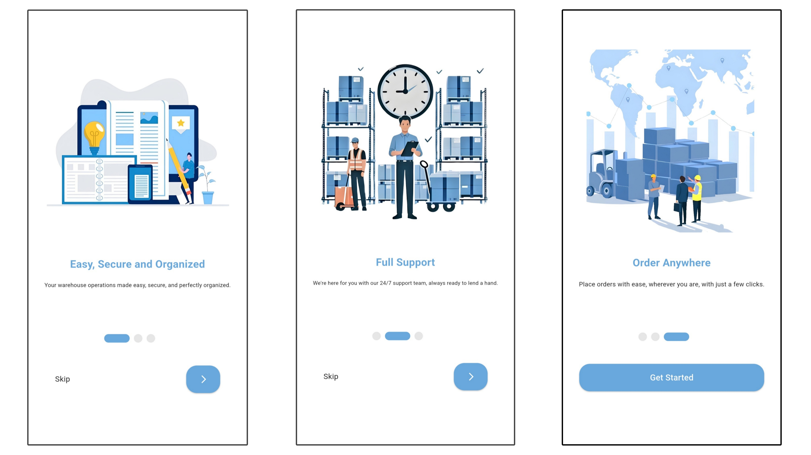
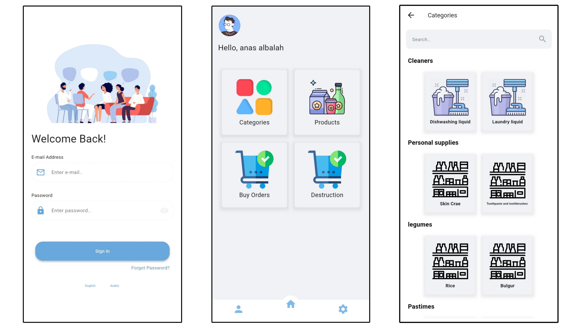

# <p align="center">📦 Invenstore: Advanced WMS</p>

<p align="center">
  
  
  
</p>

---

## 📖 Overview

**Invenstore** is a sophisticated **Warehouse Management System (WMS)** designed to streamline logistics and inventory workflows. Developed as a final-year project at the **University of Damascus**, it bridges the gap between complex backend logic and intuitive, cross-platform user interfaces.

> [!IMPORTANT]
> **Academic Recognition:** This project received a final grade of **98/100** for its technical excellence and comprehensive implementation.

---

## 📽 Visual Experience

<div align="center">
  <table>
    <tr>
      <td align="center"><b>🌐 Web Dashboard & Analytics</b></td>
      <td align="center"><b>📱 Mobile Interface</b></td>
    </tr>
    <tr>
      <td align="center">
        <br/>
        <sub><i>Log in view</i></sub><br/><br/>
        <br/>
        <sub><i>Main Analytics Dashboard</i></sub>
      </td>
       <td align="center">
        <br/>
        <sub><i>on boarding View</i></sub><br/><br/>
        <br/>
        <sub><i>mobile screens</i></sub>
      </td>
    </tr>
  </table>
  
  <br/>
  <a href="https://github.com/leenrabbou/Invenstore-WMS/">
    
  </a>
</div>

---

## 🎯 Project Scope & Core Objectives

Invenstore was designed to tackle the complexities of modern logistics by providing a unified platform that connects **Factories, Warehouses, and Distribution Centers**.

### ✅ Functional Requirements (Fully Implemented)

#### 1. Warehouse & Inventory Management

- **Dynamic Stock Control:** Real-time tracking of product quantities (Healthy, Expired, Damaged).
- **Multi-Location Support:** Managing inventory across multiple geographical hubs.
- **Low-Stock Alerts:** Automated warning system based on minimum quantity thresholds.

#### 2. Advanced Logistics Operations

- **Inter-Warehouse Transfers:** Creating and tracking stock transfer requests.
- **Distribution Workflow:** Managing centralized requests to local hubs.
- **Destruction Management:** Documented disposal of expired goods with **Cause Tracking**.

#### 3. Security & User Governance

- **Multi-Level Auth:** Secure login with **Email Verification** and **OTP**.
- **RBAC (Role-Based Access Control):** Granular permissions powered by Spatie.
- **Account Governance:** Dynamic "User Banning" system.

#### 4. Analytics & Reporting

- **Interactive Dashboard:** High-level performance summary with `fl_chart`.
- **Cross-Platform Reporting:** Exporting statistics to **PDF and Excel** formats.

---

## 🛠 My Technical Contributions (Frontend Lead)

As the **Frontend Architect**, I focused on building a robust, responsive, and real-time user experience.

- **🏗 State Management:** Architected using the **Provider** pattern for predictable data flow.
- **⚡ Real-time Sync:** Integrated **Pusher SDK** for instantaneous notifications.
- **📱 Responsive Design:** Custom layout engine adapting fluidly between **Web** and **Mobile**.
- **🌍 Localization (i18n):** Bi-directional system supporting **Arabic (RTL)** and **English (LTR)**.
- **🎨 Dynamic Theming:** Global Theme Provider for **Dark** and **Light** modes.

---

## 📁 Project Architecture (Frontend)

The codebase follows **Clean Architecture** principles to ensure maintainability:

```bash
lib/
├── 📂 Models/         # POJO classes & JSON Serialization
├── 📂 Providers/      # Business logic & State controllers
├── 📂 Screens/        # UI Layer (Responsive Views)
├── 📂 Services/       # API Clients & WebSocket (Pusher) logic
├── 📂 Localization/   # Translation engines & Locale assets
├── 📂 Theme/          # Global UI styles & Color palettes
├── 📂 helper/         # Utilities, Validators & Constants
└── 📄 main.dart       # App bootstrap & Provider root
```

---

## 📊 Project Metrics

- **Final Grade:** `98%` ⭐
- **API Integrations:** `50+` REST Endpoints 🔗
- **Code Volume:** `10,000+` Lines of clean code 💻

---

## 📄 Documentation & Resources

Access the full technical breakdown, including ERD diagrams and system analysis:

- [📂 **View Backend Repository (Laravel)**](https://github.com/AnasAlbalah/WMS)
- [📂 **Download Full Project Report (PDF)**](docs/Invenstore_Report.pdf)

---

## 👥 Development Team

- **Leen Rabbou** - _Frontend Developer_
- **Yaman Assi** - _Frontend Developer_
- **Mohammad Anas AlBalah** - _Backend Developer_
- **Mohammad Hosni Wees** - _Backend Developer_

**Supervised by:** Eng. Najma Islam Majed Al-Tair

---

<p align="center">
  <b>University of Damascus</b><br>
  Faculty of Information Engineering<br>
  <i>2025 • Software Engineering Milestone</i>
</p>
